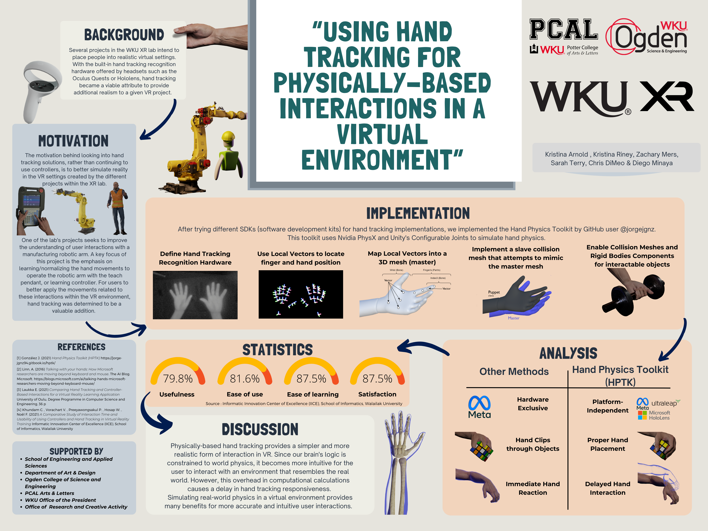

# WKU-Hand-Tracking_Research
Unity Project that uses hand tracking for physics interactions including a a manufacturing robot. This unity project uses the package HPTK from the user jorgejgnz and the ultraleap unity package

To test it you will need an ultraleap hand tracking camera
##Poster

## XR Files Student Spotlight

## References
+ This project uses the HPTK Package from jorgejgnz https://github.com/jorgejgnz/HPTK
+ Also uses the Ultraleap package for Unity https://github.com/ultraleap/UnityPlugin

